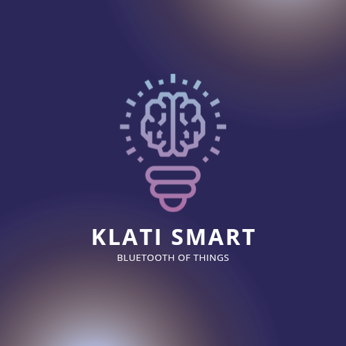
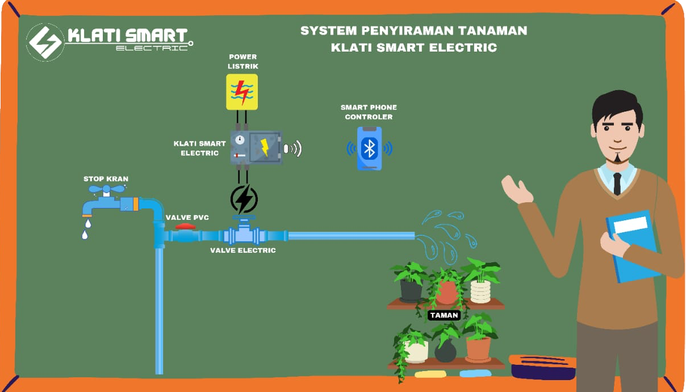

# Welcome
Let's develop together

## Build Project
Facilitate the community to interact with activities in the field of farming or housing

## Logo
[](https://klatismart.github.io/) [](https://klatismart.github.io/)

# Plan
BoT (Bluetooth of Things)

# What is BoT?
It is a smart thought of a system connecting between devices to optimize the way of operation.

# How to connect?
```txt
            Pairing
               |
        ________________
       |                |
   Bluetooth        Smartphone
    Arduino       Android Studio 
```

## Details
[](https://klatismart.github.io/)
